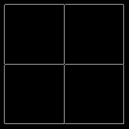

# Problem Set 1: Edges and Lines
[link to problems](https://docs.google.com/document/d/13CJgtDr8kIX9KIrs6BYFDF6-N7cfAyX0R54v8CWoqmQ/pub?embedded=true)

### 1. Edge Image  
a)  
>
> 

### 2. Hough Transform for Lines
a) Hough Accumulator &emsp;&emsp;&emsp;&emsp;&emsp;&emsp; b) Hough Peaks   &emsp;&emsp;&emsp;&emsp;&emsp;&emsp;&emsp;&emsp;  c) Detected Hough Lines
>
>    

d) What parameters did you use for finding lines in this image?  

    The parameters are as follows:
    Canny thresholds: 100, 200
    Hough accumulator sizes: theta is [-180, 180] and d is [0, #pixelsondiagonal]
    Hough peaks method: Simple non maximal suppression with window size 3 and threshold 90% of max 
    
### 3. Hough Lines with Noise
a) Noisy input image & Smoothed input image
>   

b) Binary edge images for noise image and smoothened image  
>   

c) Accumulator array and detected lines  
>   

  What you had to do to get the best result you could?  
    
    Just adjusting the blur params (window size and sigma) to smoothen all the noise does the job

### 4. Finding Lines on Real Images
a) Real image & Smoothed monochrome image
>   

b) Edge Image c) Hough Accumulator 
> &emsp;&emsp;&emsp;&emsp;   

Detected Lines  
> >  

### 5. Hough Transform for Circles  
a) Smoothed image, Edge Image & Detected Circles  
>      

b) Circle detection over variable radii  
>  

What you had to do to find circles?  

    1. Adjust the canny edge thresholds to remove any noisy edges
    2. customize shape of hough peak detector, so no spurious circles are detected

### 6. More realistic images  
a) Detected hough lines on real image  
>  

b) "Likely the last step found lines that are not the boundaries of the pens. What are the problems present?"
  
        
    Hough lines detect all the edges that run straight. They need not be of the pens. So, we should try finding lines
    that are parallel to each other and are near by each other.
    This logic might not work in production (real life) but will work in this example as all the pens in the image are
    not nearby lying parallel to each other.  
c) Just the pen edges  
>  

### 7. Finding Circles on the clutter image
a) Detected Circles  
>  

b) "Are there any false alarms? How would/did you get rid of them?"
  
    Yes. 
    One way is to eliminate false votes caused by clusters of spurious edge pixels. This can be done by n-correlating 
    hough accumulator with normalized gaussian filter.
    This will eliminate dense accumulator regions which are not distributed towards a center.  

### 8. Sensitivity to distortion
a) Detecting Lines and Circles  
>    

b) "What might you do to fix the circle problem?"  

    Warping using known homography is a hack I did to find the circles very aligned. In real usage, if we do not know 
    the homography transformation, we might have to find it.
    
    Another way of fixing the circle problem is to do fuzzy voting on the accumulator array. That is, we add a vote
     for all accumulator cells containing a vote. 
     That is we can blur the accumulator with a flat or gaussian kernel to distribute the votes and then we find the 
     centroid of dense distributions (which might look like fuzzy ellipses). From the shape of the distribution, we 
     derive the warping of coins and detect their contours.          
c) Fix distortion problem  
>    

