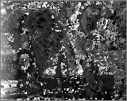
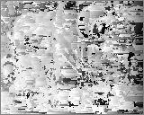
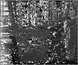

# Problem Set 2: Window-based Stereo Matching
[link to problems](https://docs.google.com/document/d/1WcljLaRxL-Pj3VWYz7JtYysYoZtRZoLIrTG2x48uVWE/pub?embedded=true)

### 1. Disparity on Synthetic textured image
a) Disparity with respect to left & Disparity with respect to right 

>  

### 2. Disparity on Real images
a)  
>  

Ground Truth
>  

b) "Description of the differences between your results and ground truth"
  
    The calculated disparity cannot be as good as ground truth as finding correspondences for triangulation is very hard

### 3. Disparity on Noisy Images
a) Gaussian Noise over one image

>  

b) Contrast Difference

>  

    The used similarity method SSD is sensitive to noise (gaussian or contrasting change) and hence can cause error in 
    calculated disparities

### 4. Normalized Correlation for finding correspondences

a) Disparity with respect to left & Disparity with respect to right  
>   

b) 
N-Corr disparity finding on image pair with Gaussing Noise on one image
Left Disparity Map,   Right Disparity Map
>   

N-Corr disparity finding on image pair with Gaussing Noise on one image
>   

#### 5. Disparity on second pair of images
a)  
>   

Ground Truth
>  

    Images in pair 2 does not have good texture and thus has less correspondences available to find the disparity.