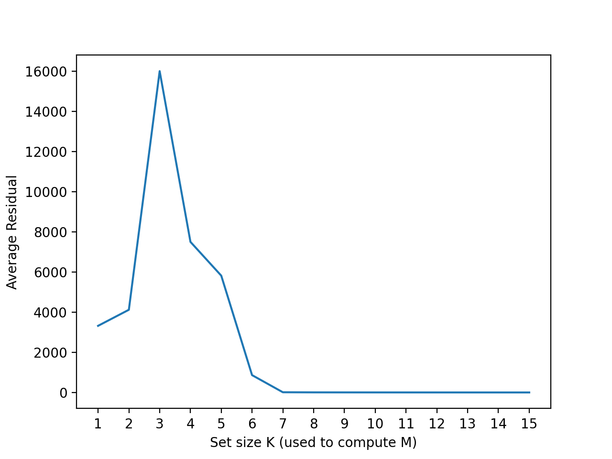
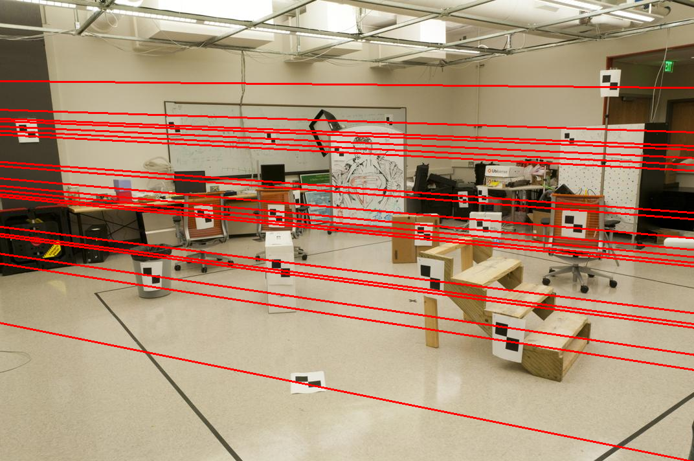
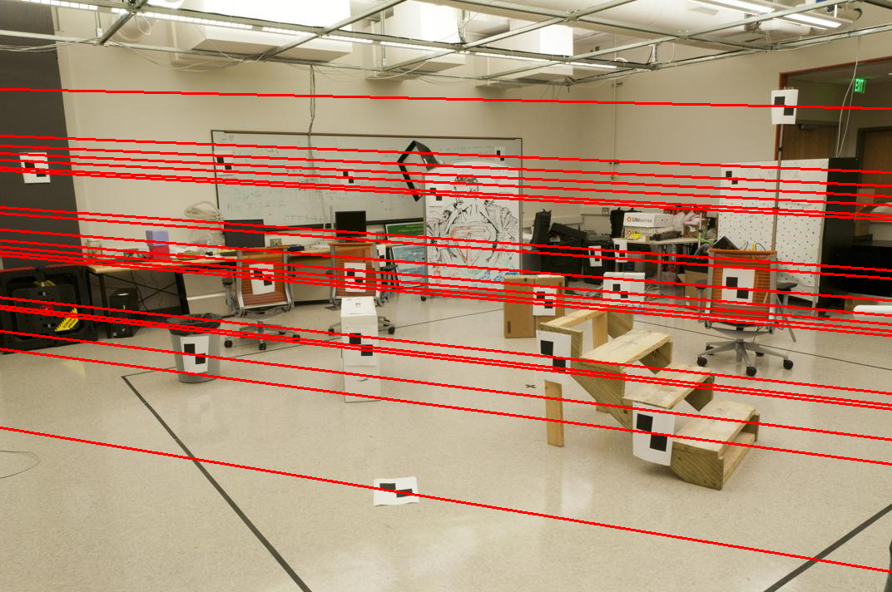
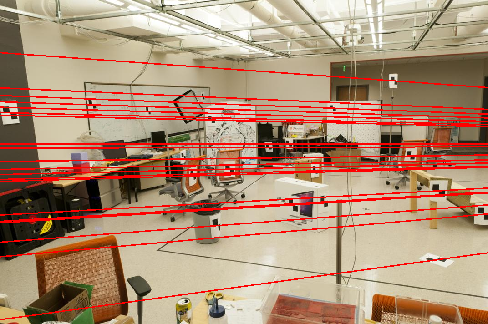

# Problem Set 3: Geometry
[link to problems](https://docs.google.com/document/d/1XsW9k_exgVwCy6CdwgUV3wLKwmFliVdmfAH74Ba4drc/pub?embedded=true)

### 1. Calibration
a) Solving for the Projection Matrix (M) 

        M matrix: 
        [[-0.45827554  0.29474237  0.01395746 -0.0040258 ]
         [ 0.05085589  0.0545847   0.54105993  0.05237592]
         [-0.10900958 -0.17834548  0.04426782 -0.5968205 ]]

        Estimated projection of pt corresponding to (0.1406, -0.4527) is (0.14190607674908876, -0.4518430095960972)

        ssd_error = 0.00016877578217198402
        residual = 0.012991373375127974 

b) Effects of Over Determined System 

        Residuals (each row represents avg residual for k size sets k = [8, 12, 16] ) :
        [[11.579 1.930 2.064]
         [3.123 12.835 2.063]
         [2.939 2.123 2.296]
         [2.906 2.141 2.226]
         [9.476 2.520 1.997]
         [3.378 2.368 2.155]
         [29.703 2.432 2.009]
         [4.120 2.053 2.210]
         [8.506 3.366 2.065]
         [6.964 2.933 2.210]]
        Average residuals over all random tests  for k size sets k = [8, 12, 16]: 
        [8.270 3.470 2.129]
        Best M matrix and with residual (1.9301583928739419) 
        [[0.007 -0.004 -0.001 -0.827]
         [0.002 0.001 -0.007 -0.562]
         [0.000 0.000 -0.000 -0.003]]

  With K ranging from 1 to 16
  
       Residuals (each row represents avg residual for k size sets k = range(1, 16) ) :
        [[1680.117 1644.159 2189.909 1659.030 124.350 10.600 3.899 6.960 3.309 3.209 3.720 2.146 1.980 2.521 1.930]
         [1688.761 1637.629 1265.277 729.970 1183.895 60.274 6.617 3.499 2.291 5.007 2.952 2.404 2.229 2.198 8.564]
         [34656.293 1667.832 8390.976 1902.120 543.184 31.209 9.631 3.477 2.536 3.352 2.371 2.144 2.267 2.030 2.104]
         [34656.293 1638.935 1494.773 368.262 6594.102 6.172 5.359 6.319 4.508 3.364 2.511 2.085 2.112 2.221 3.082]
         [1660.474 1659.556 2543.648 261.312 151.064 22.813 26.305 3.614 7.340 3.822 3.960 2.427 2.117 1.997 2.088]
         [1692.014 1562.114 1899.316 405.374 2540.622 19.782 5.345 3.143 5.481 13.832 3.245 2.758 2.484 2.514 2.378]
         [1617.974 1735.353 1555.920 326.433 797.167 12.585 11.326 3.559 3.309 3.120 9.014 2.350 2.285 2.645 2.372]
         [1690.906 1612.017 830.671 492.066 106.227 16.014 10.700 2.372 11.422 2.379 7.890 2.356 7.271 2.080 2.518]
         [1680.131 1704.541 321.103 621.941 432.021 52.038 4.258 5.914 3.228 3.031 4.313 2.352 2.599 6.330 6.492]
         [1607.376 1495.417 511.141 442.597 28.476 33.875 27.713 11.966 2.595 2.853 9.907 2.552 10.746 2.232 3.873]]
        Average residuals over all random tests  for k size sets k = range(1, 16): 
        [8263.034 1635.755 2100.273 720.911 1250.111 26.536 11.115 5.082 4.602 4.397 4.988 2.358 3.609 2.677 3.540]
        Best M matrix and with residual (1.9303865151720274) 
        [[0.007 -0.004 -0.001 -0.826]
         [0.002 0.001 -0.007 -0.564]
         [0.000 0.000 -0.000 -0.003]]
         
   Average Residual over 10000 trials with K sizes ranging from 1 to 15
   >

"Explain any difference you see between the results for the different k’s"
    
     When sampled over many trials, as K increased the average residual decreased. That means, with help of more 
    correspondences, we just got a better estimation of calibration. 
    The effects of over-constraining can be seen in few random trials where residuals increased as K size increased, but
    this could be only due to few correspondences with error.
    Although, overdetermined systems might not have best solutions, I guess the correspondences we have are
    homoschedastic and so, with bigger K sizes the calibration just got better.
    
One thing to note here: The residual started increasing rapidly when k<6, that is because at least 6 point pairs (cuz of 11 DoF of M) are needed to compute the projection matrix. 

c) "The location of the camera in real 3D world coordinates"
    
    Camera Center:
    [-1.51251 -2.35189 0.28256]
   
   

### 2. Fundamental Matrix Estimation
a) "The matrix generated from your least squares function"

     Calculated Fundamental matrix:
      [[-6.60698417e-07  7.91031621e-06 -1.88600198e-03]
       [ 8.82396296e-06  1.21382933e-06  1.72332901e-02]
       [-9.07382302e-04 -2.64234650e-02  9.99500092e-01]]
      and its rank is 3
      
b) The matrix above has a arank of 3 but Fundamental matrix should have a rank of 2. Setting the smallest eigen value of F to zero sets the rank of matrix to 2.

    Fixed Fundamental matrix:
    [[-5.36264198e-07  7.90364771e-06 -1.88600204e-03]
     [ 8.83539184e-06  1.21321685e-06  1.72332901e-02]
     [-9.07382265e-04 -2.64234650e-02  9.99500092e-01]]
    and its rank is 2

c) Epipolar Lines from the estimated F
> 

d) Normalizing points

    Tª:
    [[ 0.00106045  0.         -0.59273595]
     [ 0.          0.00106045 -0.34528102]
     [ 0.          0.          1.        ]]
    Tᵇ:
    [[ 9.39849624e-04  0.00000000e+00 -5.79605263e-01]
     [ 0.00000000e+00  9.39849624e-04 -3.26033835e-01]
     [ 0.00000000e+00  0.00000000e+00  1.00000000e+00]]
    f_:
    [[-0.02057003  0.28934424  0.01114003]
     [ 0.19879812 -0.05020881  0.71651561]
     [ 0.04808721 -0.59830893 -0.00260283]]
     
e) Correct the F to work with Normalized points
  
    corrected f:
    [[-2.05013117e-08  2.88377595e-07 -7.19665857e-05]
     [ 1.98133978e-07 -5.00410710e-08  5.78963308e-04]
     [-5.09565877e-06 -7.94957160e-04  1.90182869e-02]]

Epipolar Lines from the normalized F
> 

