# Problem Set 4: Harris, SIFT, RANSAC
[link to problems](https://docs.google.com/document/d/1DlyziyQB163r1Lx3F4-Tanm8Oq4O9-W3X5Hpdw4QGUE/pub?embedded=true)

### 1. Harris Corners
a) Input, Gradient x and Gradient y

>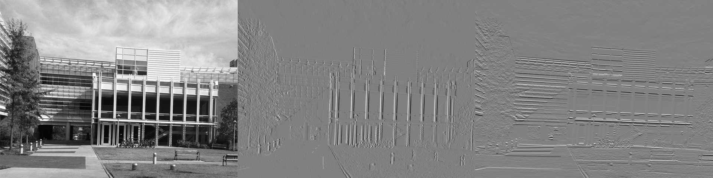  
>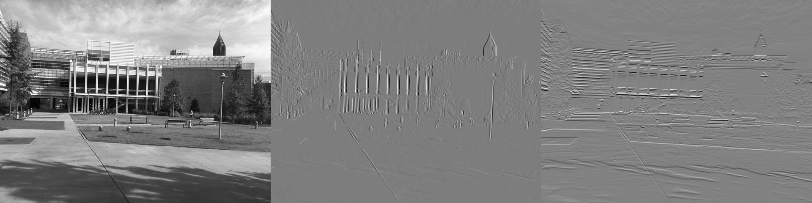  

b) Harris Response
>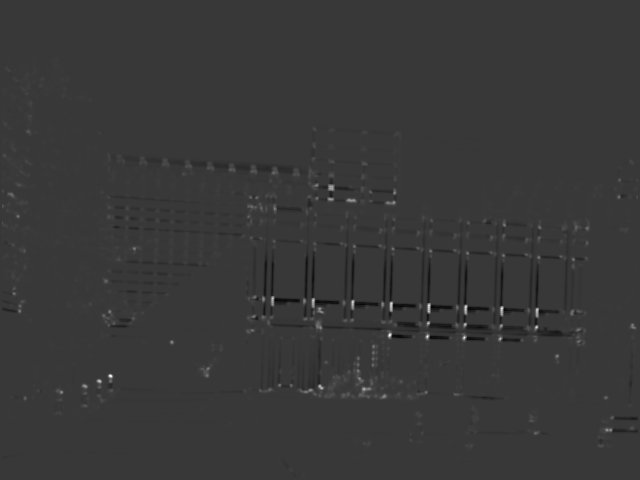  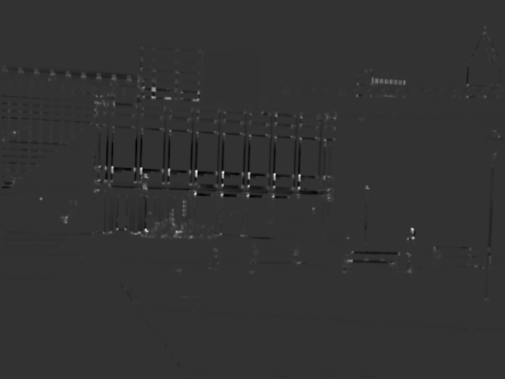  
>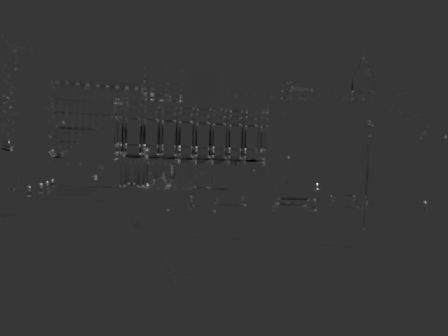  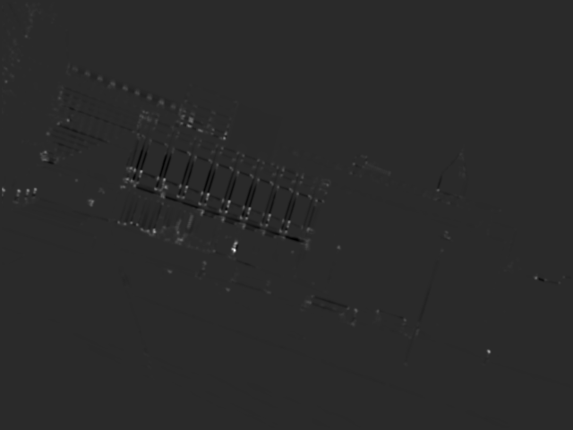  

b) Corners from Harris Response
>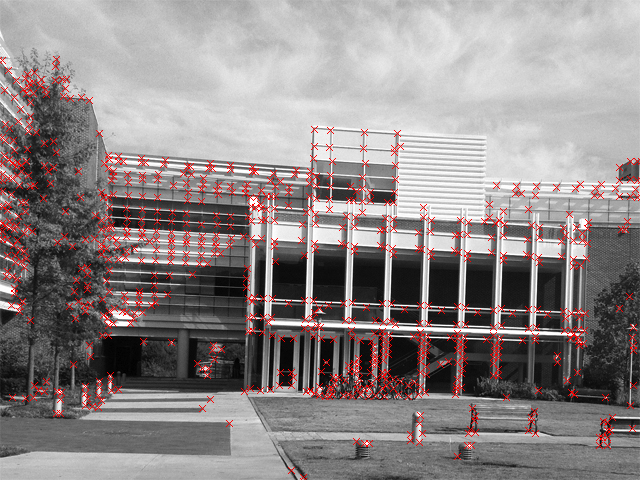  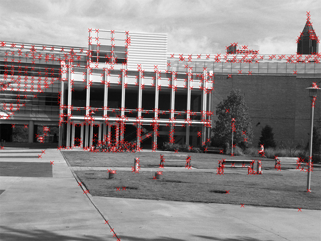  
>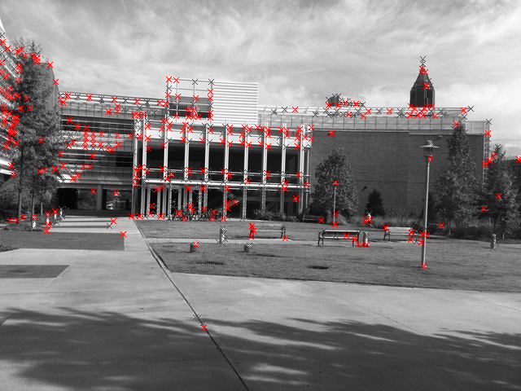  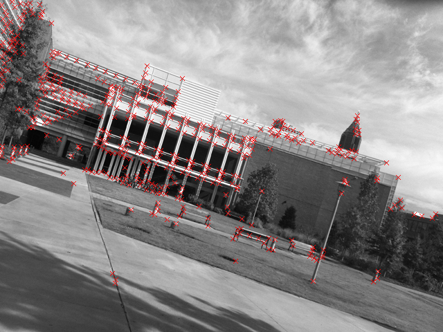  

"Describe the behavior of your corner detector including anything surprising, such as points not found in both images of a pair."
 
    Corner detection is sensitive to noise. There were corners detected at places with sharp intensity changes. So, 
    often when there is sharp noise, a corner is detected and the same corner is not detected in the pair image. 
    
    Also, few corners that can be clearly perceived by humans are not detected by the harris algo. For example, the 
    rectangular corners of the lawn in front of the campus building in simA.jpg is not detected, but it looks well 
    like an interest point. 
    The reason could be because, the lawn and the ground has similar pixel intensities. But the reason why humans see it
    might be because we are aware of the entire lawn as a separate entity from ground and so, are able to see cornerness
    at those pixels. Also, such pixels could cause only smaller harris responses and are prone to thresholding done
    before the non maximal suppression step.
    
### 2. SIFT Features

a) Interest Points Visualized
>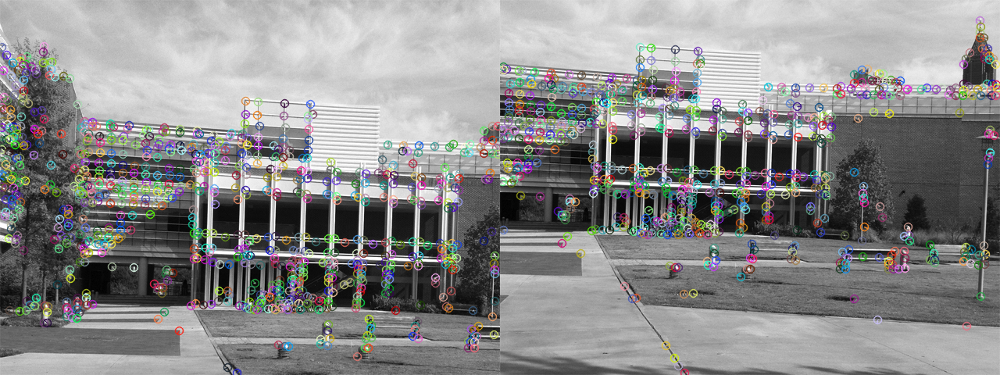  
>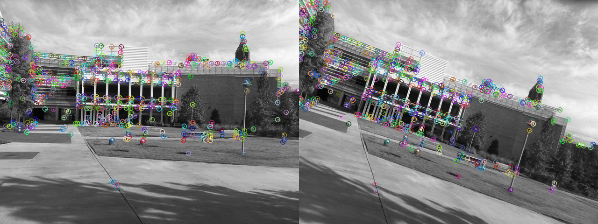   

b) Putative Pairs
Darker lines signify higher distance between point descriptors  
transA–transB Pair
>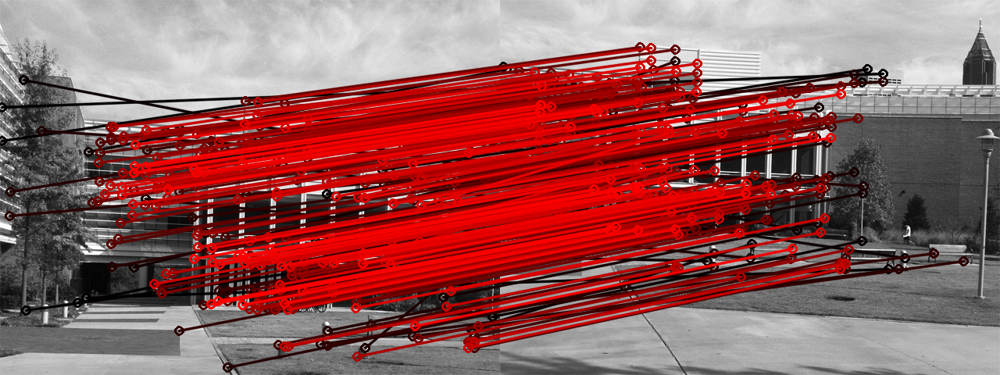  

simA–simB Pair
>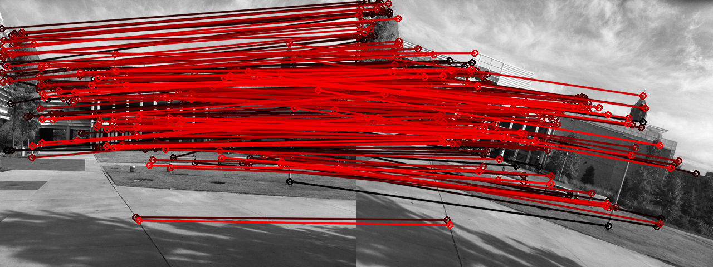  

### 3. RANSAC
a) Consensus Set between translated image pair  
>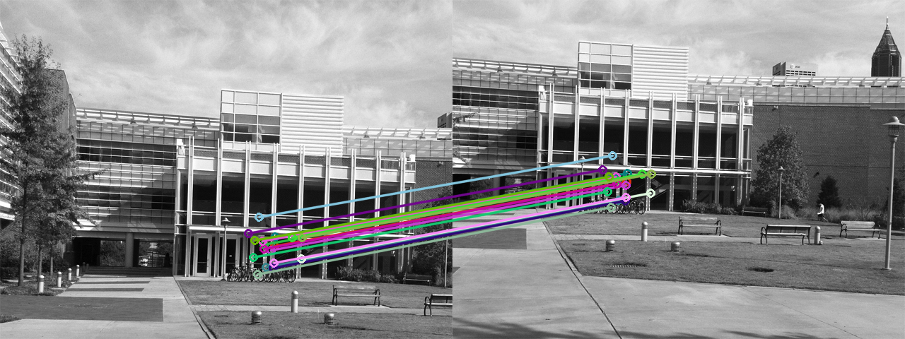  

b) Consensus Set between image pair with similarity transformation  
>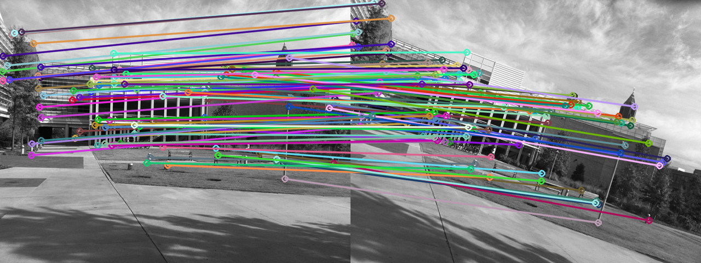  

c) Consensus Set between image pair with similarity transformation, but assuming that the trasformation is affine  
>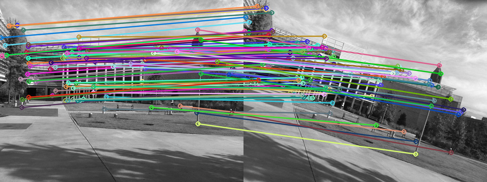  

d) Stitching similarity images with warping
>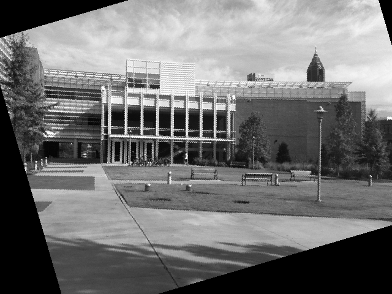  
>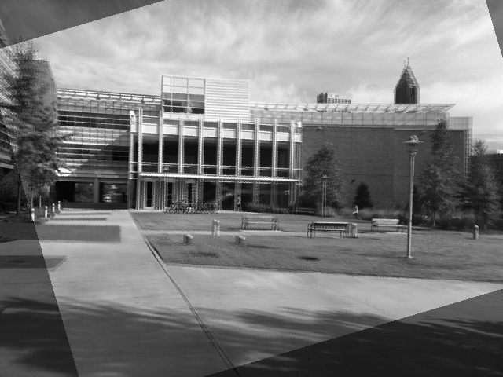  

e) Stitching affine images with warping
>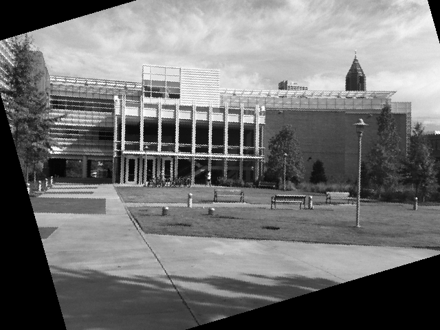  
>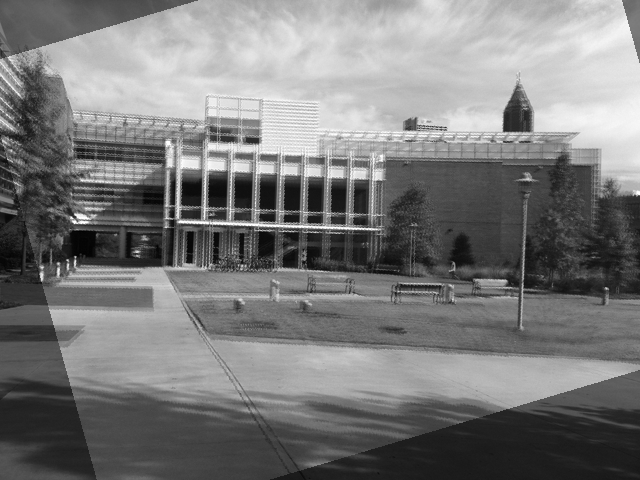  

"Comment as to whether using the similarity transform or the affine one gave better results, and why or why not."
  
    Using the similarity transform gave better alignment. This could be because, in calculating similarity transform 
    matrix we only need to solve for 4 unknowns where as in affine we solve for 6. Solution for the two extra unknowns
    can come along with some error. Probably that can have an effect. 
    But in the above case, there are too many factors that effect the efficiency of alignment. Random sampling can 
    produce different results each time and the way of consensus voting hugely affects ransac.  
