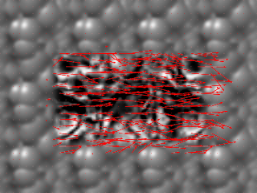
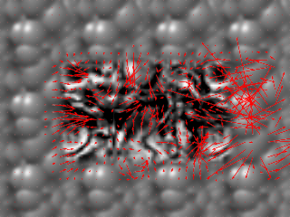
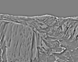
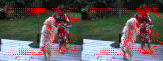
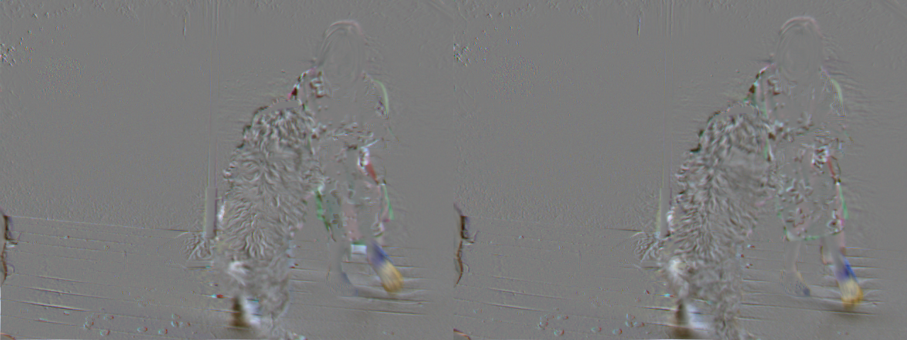

# Problem Set 5: Optic Flow
[link to problems](https://docs.google.com/document/d/1Bi2_CThMfoLEf4TCMhyFR7cls6t3LAiSz7YYYV89eoE/pub?embedded=true)

### 1. Lucas Kanade Optic Flow
a) Flow estimation on Synthetic image pairs  
>    

b) LK on Larger Shifts
>      

"Does it still work? Does it fall apart on any of the pairs?"
    
    It does fall apart on all of heavily shifted images.
    Motion flow can only be estimated when shift in pixels are small. Since, all the lk flow detector does is compare 
    gradients ix and iy to time gradient, when time gradient fails (i.e, when delta is too high), it falls apart.   
    
### 2. Gaussian and Laplacian Pyramids
a) Gaussian Pyramid
>    
>    

b) Laplacian Pyramid
>    
>    

### 3.  Warping by flow
a) 
DataSeq1 warping & diff  
>     
DataSeq2 warping & diff  
>     

### 4. Hierarchical LK optic flow
a) Over synthetic images
the displacement images between the warped I2 and the original I1 
> 

the difference images between the warped I2 and the original I1
> 

b) Over DataSeq1
the displacement images between the warped I2 and the original I1 
> 

the difference images between the warped I2 and the original I1
> 

c) Over DataSeq2
the displacement images between the warped I2 and the original I1 
> 

the difference images between the warped I2 and the original I1
> 

### 4. Extra Credit for Juggle
a)  
the displacement images between the warped I2 and the original I1  
> 

the difference images between the warped I2 and the original I1  
> 

        With some changes I was able to derive motion flow for this sequence. It was hard because the shift in pixels 
        is too high for lk detection (~35 pixels).
        The detected optical flow was not too bad, as it shows the approximate magnitude and direction of shift. 
        
        Notice that there was some flow detected over the static pixels around the ball. This is because, the actual 
        flow was only detected in highest pyramid level and since the image is scaled multiple fold, the pixels around a
        moving object are also affected, not to mention the noise added by missing/new pixels at boundary of moving 
        object.     

