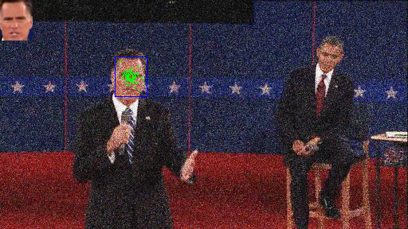
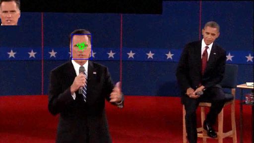
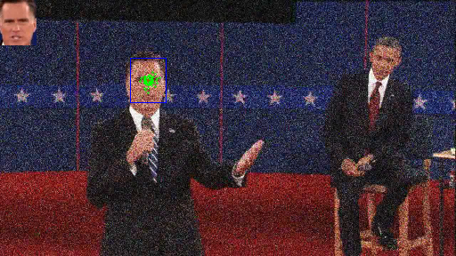
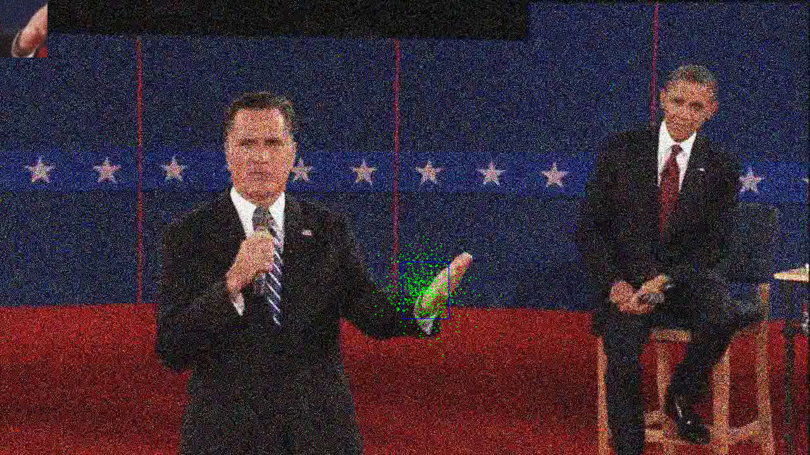

# Problem Set 6: Particle Tracking
[link to problems](https://docs.google.com/document/d/1ZGdXBjLgr9U-6wdIgcEyRmDHckJFlyhnSWXK8OsduS4/pub?embedded=true)

### 1. Particle Filter Tracking
a) Template (Romney's face) tracking on presidential debate.avi

Tracking State at frame numbers 28, 84, 144  
>       

b) "Discuss the trade-offs of window size and what makes some image patches work better than others for tracking"
    
    Picking up the correct window size for tracking can be hard. 
    With bigger windows the templates hold enough information about the target and thus will have less ambiguity at 
    localization. But this comes with a downside of noise from background. With bigger windows, if the background 
    changes, depending on the distance method, tracking becomes difficult. 
    
    With smaller windows we might be able to avoid disturbances in background changes but we might not have entire 
    information in the widow to track the target. For example, if the window only has a patch of skin but the target is
    the head, the tracker will be lost among the other identical patches of skin on the head. 
    
c) "Discuss how changing σMSE parameter alters the results "
    
    σMSE defines the sensitivity of score to the distance method (mse). σMSE should be set to a value that corresponds 
    to relevance of target distance detection.
    
    With higher σMSE's, scoring does not happen correctly and particle weights are distributed evenly, making the 
    irrelevant particles to also get re-sampled, resulting in poor particle tracking performance. 
    
    With lowers σMSE, the scores tend to be smaller and variations between them lesser. Resulting in poor particle 
    tracking performance.
    
d) "Try and optimize the number of particles needed to track the target"
  
    Roughly only 30 particles, at least, were required for tracking Romney's face successfully till the end.

e) Tracking Romney's face from noisy debate clip  
Tracking State at frame numbers 14, 32, 46  
>     

### 2. Appearance Model Update

a) Tracking Romney’s hand with model update  
Tracking State at frame numbers 15, 50, 140
>     

b) Tracking Romney’s hand on noisy debate  
Tracking State at frame numbers 15, 50, 140  
>     

    above params just does the job to track his hand until mid of the video. A noise tolerant template update logic
    might help the tracker to maintain the target
    
### 3. Mean-Shift Lite
  
a) Tracking Romney’s face with histogram comparision instead of MSE  
Tracking State at frame numbers 28, 84, 144  
>     

b) Tracking Romney’s hand with histogram comparision instead of MSE  
Tracking State at frame numbers 15, 50, 140  
>     

    Histogram comparison is very sensitive to background colors. So, when Romney's hand moves down the change in the
    background from blue to red creates confusion for the particles and keeps them on the blue background which was in
    the template. A fix for this is to adjust the patch size to not include any background

### 4. Incorporating More Dynamics

a) Tracking blond-haired woman  
Tracking State at frame numbers 40, 100, and 240  
>     

b) "Try and optimize the number of particles needed to track the model in this video. Compare that to the number you found in problem 1-d . Why is this number different?"

    Roughly 1000 particles were required to track the blond-woman. In this model, I had used particle velocities and 
    window sizes in the particle states. 
    The dynamics included position to be updated according to the velocity.
    With multiple dimensions in the particle state (i.e, 5 - 2 for position, 2 for velocity, 1 for window size), more 
    particles were required in maintaining/tracking or scanning the target.  
