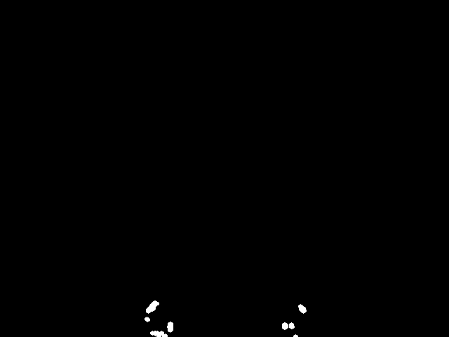
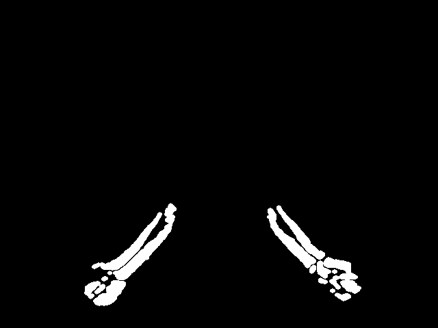
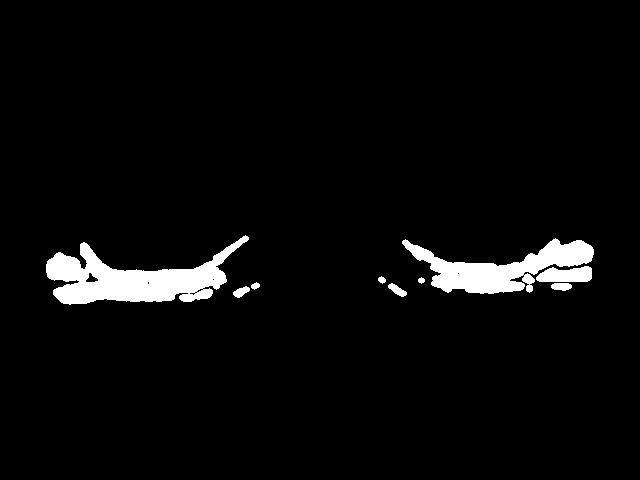
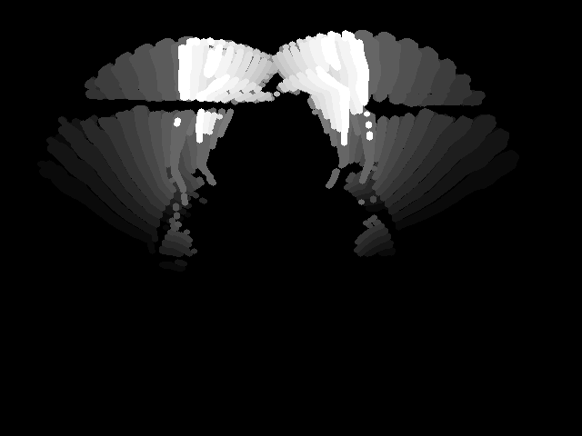
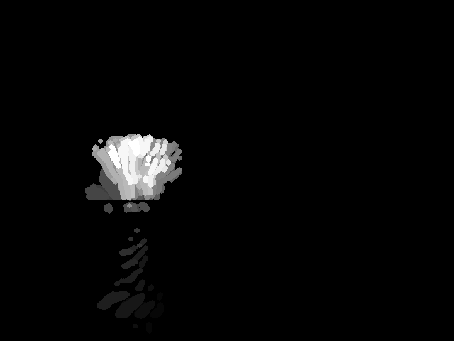
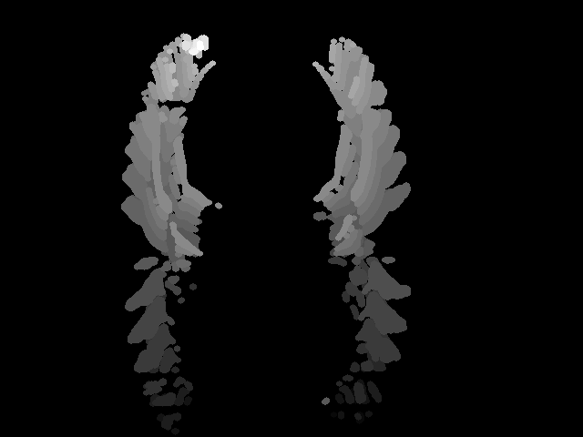

# Problem Set 7: Motion History Images
[link to problems](https://docs.google.com/document/d/1ri0YKEKL63WUcFtq0AGyrlMl2d8auzZI424dOXVsDGg/view)

### 1. Frame-differenced MHI
a) Frame difference (Thresholding + morphological operation)
Binary Frame diff images at frames 10, 20, 30

>    
  
b) Motion History Images
>    
  
    action/       1     2     3
    tau           25    35    45
    end           45    40    50
    
### 2. Recognition using MHIs
a) Recognition effeciency when tested on the same training data
      
      Confusion matrix: (Rows - predicted, Cols - actuals) w/ same test & train data
      [[0.34295533 0.         0.00206186]
       [0.         0.28109966 0.        ]
       [0.         0.         0.37388316]]
       
b) Recognition effeciency when testing is done on a person whose actions are not used for training

      Confusion Matrix: (Rows - predicted, Cols - actuals) w/ test person - 1 
      [[0.34891486 0.         0.01001669]
       [0.         0.25208681 0.11185309]
       [0.02671119 0.         0.25041736]]
       
      Confusion Matrix: (Rows - predicted, Cols - actuals) w/ test person - 2 
      [[0.29133858 0.         0.03412073]
       [0.         0.28871391 0.        ]
       [0.02362205 0.         0.36220472]]
       
      Confusion Matrix: (Rows - predicted, Cols - actuals) w/ test person - 3 
      [[0.32421053 0.         0.        ]
       [0.         0.30736842 0.        ]
       [0.         0.00421053 0.36421053]]
       
      Averaged Confusion matrix: (Rows - predicted, Cols - actuals)
      [[0.32148799 0.         0.01471248]
       [0.         0.28272305 0.03728436]
       [0.01677774 0.00140351 0.32561087]]
       
In this recognition task, tau is used same for all the actions. And, unlike mentioned in the problem description, MHI and MEIs at every frame after tau'th frame is used for recogition task.
       
